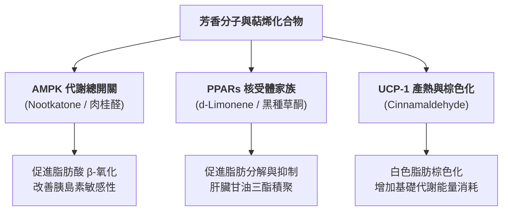

# 法系醫學芳療與臨床植物醫學：新陳代謝、細胞能量學（AMPK/PPAR）與內分泌網絡調控專題
*(French Medical Aromatherapy & Clinical Phytotherapy: Metabolic Regulation, Cellular Bioenergetics, and Endocrine Network Modulation)*

**文獻整理與臨床研討專題**  
**日期**: 2026-08-17  
**專案儲存庫**: `aromatherapy-git-notes` (Branch: `main`)

---

## 摘要 (Abstract)

現代代謝症候群（Metabolic Syndrome）、胰島素抗性（Insulin Resistance）、非酒精性脂肪肝（NAFLD）與內臟脂肪過度堆積，其生理核心為**細胞能量感應失調（AMPK / PPAR 通路障礙）**與**低階慢性發炎（Low-grade Chronic Inflammation）**。

法系醫學芳療（L'aromathérapie médicale）從**「體質代謝引流（Drainage Métabolique）」**與**「排泄器官負荷（Émonctoire）」**理論出發，結合現代受體藥理學，證實天然萜烯與芳香分子能透過調控 **AMPK（細胞代謝總開關）**、**PPARs（過氧化物酶體增殖物活化受體）**、**GLUT4 轉運體**及 **UCP-1（解偶聯蛋白-1）**，達到促進脂肪酸 β-氧化、增強胰島素敏感性、阻斷白色脂肪生成及誘導棕色化產熱的雙向調節效果。

本專題深入探討 *Cinnamaldehyde*、*Nootkatone*、*Thymoquinone*、*d-Limonene* 及 *Verbenone* 等核心分子的代謝藥理機轉，並建立四套臨床精準調配方案。

---

## 第一章：主控分子與細胞能量調控路徑（AMPK / PPAR / UCP-1 軸）

### 1.1 AMPK (AMP-activated Protein Kinase) —— 細胞代謝總開關
AMPK 是人體細胞能量感應的掌舵者。當 AMPK 活化時，會關閉消耗 ATP 的合成路徑（如脂肪酸與膽固醇合成），同時開啟產生 ATP 的分解路徑（如脂肪酸氧化與葡萄糖吸收）。

* **諾卡酮 / 圓柑酮 (*Nootkatone*) —— 來自葡萄柚精油 (*Citrus paradisi*)**：
  * **分子機轉**：*Nootkatone* 能直接活化肝臟與骨骼肌中的 AMPK 磷酸化，顯著促進脂肪酸的 β-氧化作用（Fatty Acid β-Oxidation）。
  * **臨床價值**：文獻證實長期攝取 *Nootkatone* 能有效對抗高脂飲食誘發之肥胖、改善耐糖異常並提升基礎代謝率（BMR）。
* **肉桂醛 (*Cinnamaldehyde*) —— 來自肉桂/桂皮精油 (*Cinnamomum verum / cassia*)**：
  * **分子機轉**：經由 PTP1B 抑制與 GRK2 途徑活化 AMPK。
  * **葡萄糖運轉**：活化 AMPK 能促進骨骼肌細胞內 **GLUT4 轉運體** 易位至細胞膜，直接發揮「擬胰島素作用（Insulin-mimetic Effect）」，加速血液中葡萄糖的清除。

---

### 1.2 PPARs (Peroxisome Proliferator-Activated Receptors) —— 脂質與糖質調控受體
PPARs 屬於核受體超家族（Nuclear Receptor Superfamily），直接調控參與脂質代謝、脂肪生成與發炎反應的基因表現。

* **右旋單萜烯 (*d-Limonene*) —— 來自柑橘類精油 (葡萄柚、檸檬、甜橙)**：
  * **分子機轉**：活化 **PPAR-α** 與 **PGC-1α**（PPAR-γ 協同活化因子-1α）。
  * **臨床價值**：抑制脂肪細胞前體分化為成熟脂肪細胞（Inhibition of Adipogenesis），減少內臟脂肪積聚，並顯著降低肝臟內甘油三酯（TG）與游離脂肪酸（FFA）濃度，對抗非酒精性脂肪肝（NAFLD）。
* **黑種草酮 (*Thymoquinone*) —— 來自黑種草籽精油 (*Nigella sativa*)**：
  * **分子機轉**：雙向調節 **PPAR-γ** 與 **AMPK**，同時下調肝臟糖質新生（Gluconeogenesis）關鍵酵素 **PEPCK** 與 **G6Pase** 的活性。
  * **臨床價值**：強效抗發炎與抗氧化，降低全身性低階發炎（TNF-α, IL-6），提升胰島素受體親和力，顯著降低糖化血色素（HbA1c）與空腹血糖。

---

### 1.3 UCP-1 (Uncoupling Protein-1) 與白色脂肪棕色化 (Browning of WAT)
白色脂肪（WAT）主要用於儲存能量，而棕色/米色脂肪（BAT/Beige Adipose）含有大量線粒體，能透過 UCP-1 進行解偶聯產熱（Thermogenesis）。

* **肉桂醛 (*Cinnamaldehyde*)**：
  * **棕色化誘導**：機能性研究指出 *Cinnamaldehyde* 能直接誘導白色脂肪細胞表現 **UCP-1**、**Pgp1c** 及 **Prdm16** 棕色化標記基因。
  * **體重調控**：將多餘的脂質熱能轉化為熱能散失，而非作為甘油三酯儲存於腰腹部，是現代芳療減重與代謝改善的突破性靶點。

---

## 第二章：法系醫學芳療之「代謝體質與排泄器官引流」理論

法系醫學芳療（Pierre Franchomme & Dominique Baudoux 體系）強調：新陳代謝障礙本質上是**排泄器官（Émonctoires）過載與微循環淤滯**的表現。

### 2.1 肝膽代謝引流與膽汁酸受體 (FXR / TGR5)
* **膽汁酸（Bile Acids）的代謝信號作用**：膽汁酸不僅消化脂肪，更是全身糖脂代謝的重要信號分子，透過活化 **FXR（法尼醇 X 受體）** 與 **TGR5 受體**，調控肝臟糖質新生與胰島素敏感性。
* **代表精油與分子**：
  * **馬鞭草酮迷迭香 (*Rosmarinus officinalis* CT verbenone)**：含 *Verbenone*（單萜酮），具強效利膽與促膽汁排空作用（Choleretic/Cholagogue），促進結合型毒素隨膽汁排出。
  * **胡蘿蔔籽 (*Daucus carota*)**：含 *Carotol*（倍半萜醇），刺激肝細胞微循環與再生，降低 GOT/GPT 轉胺酶負擔。

### 2.2 腎臟與代謝廢物排泄 (Uric Acid & Metabolic Clearance)
* **高尿酸與痛風體質**：代謝症候群常伴隨高尿酸血症（Hyperuricemia）。
* **代表精油與分子**：
  * **芹菜籽 (*Apium graveolens*)**：含 *Sedanolide*（苯酞類）與 *d-Limonene*，具備顯著的抑制黃嘌呤氧化酵素（Xanthine Oxidase）活性，促進尿酸經由腎臟排泄。
  * **杜松漿果 (*Juniperus communis*)**：含 *α-Pinene* 與 *Terpinen-4-ol*，促進腎絲球過濾率（GFR），加速代謝廢物淨化。

### 2.3 壓力和緩與內臟脂肪堆積 (HPA-Axis & Cortisol-Driven Metabolism)
* **皮質醇與內臟脂肪（Visceral Adiposity）**：慢性壓力活化 HPA 軸，持續高濃度的皮質醇（Cortisol）會活化腹部內臟脂肪細胞中的 11β-HSD1 酵素，導致脂質優先堆積於網膜與肝臟。
* **代表精油與分子**：
  * **苦橙葉 (*Citrus aurantium* ssp *amia*) / 真薰衣草**：高濃度的 *Linalool* 與 *Linalyl acetate* 作用於中樞 GABA-A 受體，平息 HPA 軸過度活化，從源頭阻斷高皮質醇引發的暴食與內臟脂肪積聚。

---

## 第三章：核心化學成分與代謝藥理矩陣表

| 芳香分子 / 官能基 | 代表精油 | 生物靶點 / 信號通路 (Receptors/Pathways) | 代謝藥理與臨床效益 |
| :--- | :--- | :--- | :--- |
| **倍半萜酮（諾卡酮 Nootkatone）** | 葡萄柚 (*Citrus paradisi*) | 活化 **AMPK** 磷酸化、促進 Fatty Acid β-Oxidation | 提高基礎代謝率（BMR）、促進內臟脂肪分解、預防高脂飲食肥胖 |
| **芳香醛（肉桂醛 Cinnamaldehyde）** | 肉桂/桂皮 (*Cinnamomum verum*) | 活化 **AMPK/GLUT4**、誘導 **UCP-1** 表現 | 擬胰島素作用、降低空腹血糖、促進白色脂肪棕色化產熱 |
| **單萜醌（黑種草酮 Thymoquinone）** | 黑種草籽 (*Nigella sativa*) | 下調 **PEPCK/G6Pase**、雙向調控 **PPAR-γ** | 抑制肝糖質新生、改善胰島素抗性、降低 HbA1c 與促發炎因子 |
| **單萜烯（右旋單萜烯 d-Limonene）** | 檸檬、甜橙、葡萄柚 | 活化 **PPAR-α / PGC-1α**、下調 SREBP-1c | 抑制脂肪生成（Adipogenesis）、減少肝臟甘油三酯、改善脂肪肝 |
| **單萜酮（馬鞭草酮 Verbenone）** | 馬鞭草酮迷迭香 | 活化膽汁酸分泌 (Choleretic)、促進 **FXR/TGR5** 途徑 | 促進肝膽引流、清除腸肝循環毒素、調節全身脂質代謝 |
| **苯酞類（芹菜酞 Sedanolide）** | 芹菜籽 (*Apium graveolens*) | 抑制 **Xanthine Oxidase**、促進腎過濾 | 降低血清尿酸濃度、改善痛風與代謝廢物沉積 |
| **單萜醇/酯（Linalool / Linalyl acetate）** | 苦橙葉、真薰衣草 | 中樞 **GABA-A** 受體、抑制 HPA 軸皮質醇 | 降解 Cortisol 誘發之暴食與腹部內臟脂肪堆積 |

---

## 第四章：四個核心臨床情境與法系精準配方

### 情境 1：胰島素抗性與血糖管理（Insulin Sensitivity & Glycemic Support）

**適用對象**：第二型糖尿病前期、空腹血糖偏高、外周組織胰島素敏感性低下者。

#### 1. 代謝塗抹油（精油濃度 4%）
* **肉桂樹皮 (*Cinnamomum verum*)**：1 滴（強效肉桂醛：活化 AMPK/GLUT4）
* **黑種草籽精油 (*Nigella sativa*)**：2 滴（黑種草酮：抑制糖質新生）
* **葡萄柚 (*Citrus paradisi*)**：4 滴（諾卡酮/Limonene：促進脂質氧化）
* **基底油**：冷壓黑種草籽植物油 5ml + 荷荷芭油 5ml（共 10ml）

#### 2. 用法與療程
* **塗抹部位**：每日早晚取 4–6 滴塗抹於腹部（以肚臍為中心順時針按摩）及雙腳腳底（湧泉穴）。
* **週期**：連續使用 4 週，觀察空腹血糖與餐後血糖變化趨勢。

---

### 情境 2：非酒精性脂肪肝與高血脂肝膽淨化 (NAFLD & Hepatic Lipid Drainage)

**適用對象**：脂肪肝、血清甘油三酯（TG）過高、肝膽引流滯留、體質過載個案。

#### 1. 肝膽淨化按摩油（精油濃度 3%）
* **馬鞭草酮迷迭香 (*Rosmarinus officinalis* CT verbenone)**：2 滴（利膽與膽汁排空）
* **胡蘿蔔籽 (*Daucus carota*)**：2 滴（活化肝細胞再生、降轉胺酶）
* **檸檬 (*Citrus limon*)**：3 滴（高含量 d-Limonene：活化 PPAR-α）
* **芹菜籽 (*Apium graveolens*)**：1 滴（代謝引流、降尿酸）
* **基底油**：聖約翰草浸泡油 5ml + 榛果油 5ml（共 10ml）

#### 2. 用法與療程
* **塗抹部位**：每日早晚取 5 滴塗抹於右上腹（肝膽反射區）與背部相對應脊椎區域。
* **週期**：採用法系 **21 天脈衝療程**（連續塗抹 21 天，停用 7 天）。

---

### 情境 3：壓力和緩與內臟脂肪堆積調理 (HPA-Axis & Visceral Adiposity)

**適用對象**：高壓族群、夜間睡眠品質佳但腹部脂肪極難消除、高皮質醇引發之代謝異常者。

#### 1. 鎮靜降 cortisol 塗抹與吸入配方（精油濃度 5%）
* **苦橙葉 (*Citrus aurantium* ssp *amia*)**：4 滴（Linalyl acetate：下調 HPA 軸）
* **大西洋雪松 (*Cedrus atlantica*)**：3 滴（倍半萜烯：鎮靜與淋巴引流）
* **甜橙 (*Citrus sinensis*)**：3 滴（d-Limonene：放鬆並促進代謝）
* **基底油**：甜杏仁油 10ml

#### 2. 用法
* **嗅吸與塗抹**：每晚睡前取 3–4 滴塗抹於胸口、太陽穴及掌心，進行 5 次深呼吸嗅吸，平息夜間 Cortisol 分泌高峰。

---

### 情境 4：高尿酸與腎臟代謝淨化 (Uric Acid & Renal Clearance)

**適用對象**：血尿酸過高、痛風發作間歇期、代謝廢物排泄不順者。

#### 1. 腎臟代謝引流油（精油濃度 2.5%）
* **芹菜籽 (*Apium graveolens*)**：2 滴（抑制黃嘌呤氧化酵素、降尿酸）
* **杜松漿果 (*Juniperus communis*)**：2 滴（促進腎過濾率）
* **檸檬香茅 (*Cymbopogon citratus*)**：1 滴（檸檬醛：抗發炎止痛）
* **基底油**：葡萄籽油 10ml

#### 2. 用法
* **塗抹部位**：每日早晚取 4 滴塗抹於後腰雙腎區域及後腳踝（太溪穴附近）。

---

## 第五章：安全性與藥理禁忌症 (Safety & Pharmacovigilance)

1. **富含酚類與強活性醛類（肉桂醛 Cinnamaldehyde）**：
   * 肉桂樹皮精油含高濃度肉桂醛，具極強皮膚刺激性與致敏風險。經皮塗抹濃度必須控制在 **0.5%–1% 以下**，且不可用於破損黏膜。
2. **單萜酮類（Verbenone）之神經毒性**：
   * 馬鞭草酮具神經毒性與通經作用，孕婦、哺乳期婦女、嬰幼兒及癲癇患者禁用。
3. **降血糖與降血脂藥物之協同效應**：
   * 本專題配方（如肉桂、黑種草）具備顯著的降血糖與增敏作用。若患者已服用口服降血糖藥（如 Metformin）或注射胰島素，使用期間需密切監測血糖，避免低血糖（Hypoglycemia）發生。

---

## 結論與展望

新陳代謝的芳療應用已超越傳統「芳香紓壓」層次，跨入**細胞能量學（Cellular Bioenergetics）**與**受體藥理學（Receptor Pharmacology）**領域。

透過精準調配 *Nootkatone*（活化 AMPK）、*Cinnamaldehyde*（促進 GLUT4 / UCP-1）、*Thymoquinone*（調節 PPAR-γ）及 *d-Limonene*（活化 PPAR-α），配合法系醫學芳療的「肝-腎排泄器官引流」，能從細胞分子層面重新校準人體的代謝動態平衡。
